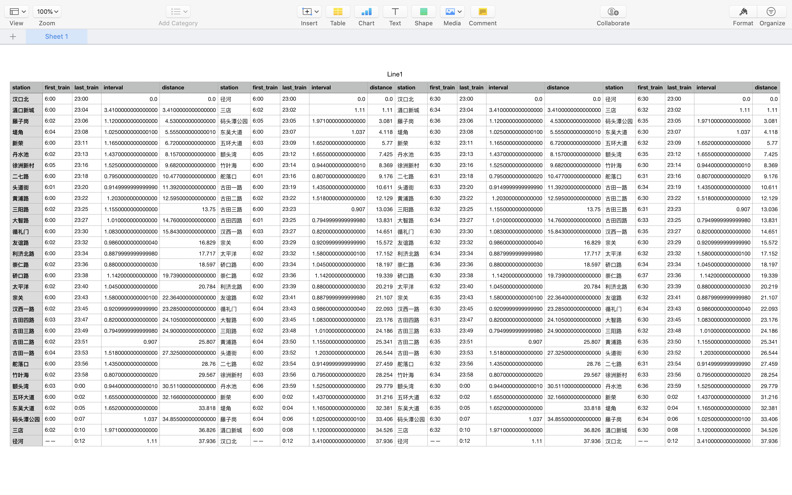

# 武汉地铁运营线路数据

1,2,3,4,6,7,8,11,阳逻. 共9条线(文件中Line12.csv为阳逻线)

有部分线路还在修建完善当中, 目前文件中只列出了在运营的线路

另外8号线建设工程分3期, 1、3期建设完毕,但3期未列入

原因如下:

- 2期仍在建设中, 1期和3期建设的站并不联通
- 3期建设的站数据缺失, 没有距离数据
- 3期专门为军运会而建设, 目前使用应该不多

 

## 数据格式

使用csv格式存储, encoding:utf-8

上图为`Line1.csv`即1号线数据

其中, A-J列为平时的数据, K-T为周六周日的数据, 二者的区别只有首尾班车时间.

A-E列和F-J列是同一条线路,不同首尾.

## 各列属性解释:

- **station**: 车站名
- **first_train**: 首班车时间
- **last_train**: 末班车时间
- **interval**: 该站与上一站之间的距离, 单位为km, 如滠口新城与汉口北的距离是3.41km, 首发站的inteval定义为0
- **distance**: 该站到首发站的距离,单位为km, 如新荣与汉口北的距离是6.72km

