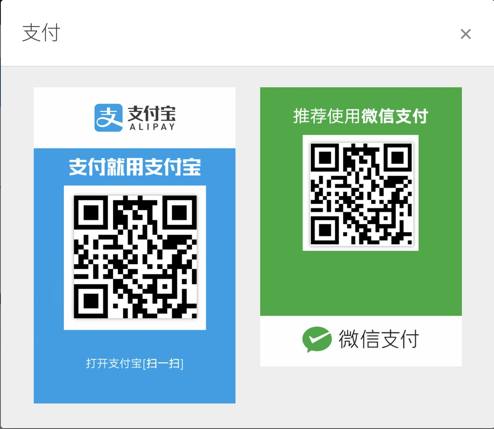

# 迭代二成果展示

## 前端

### 1. 对地铁线路图的预处理

为了实现能在主页中放大地铁线路图然后选择起点和终点，我们需要在HTML文件中实现相应的代码。首先，我们需要获得图中198个地铁站的站名和相对坐标，也就是数据的预处理。地铁线路图如下图所示。

我们本来可以选择通过人工测量的方式获取这198个点的坐标. 但是作为一个技术大组, 我们选择用程序来实现这种机械的工作. 为此，我们的组员专门研究了OpenCV，通过Python+OpenCV库识别图中的圆形(形状识别), 计算圆心的坐标, 并识别图中的地铁站站名(文字识别). 

### 2. 实现在主页地铁线路图上选择起点和终点的功能

通过使用JavaScript中的vue2-leaflet库,  vue.js框架, sjgma.js库, 我们实现了在主页地铁线路图上选择起点和终点这个非常高级的功能. 其效果如下:

① 点击左边的按钮, 可以实现放大和缩小

② 点击图中的圆圈, 就可以选中一个站

③ 点击设为起点, 设为终点, 就可以将该站选成起点或终点

### 3."S形曲线"的初步实现

我们希望在我们的界面中实现如下图所示的S形的曲线, 即用HTML代码画出如下的曲线. 这里用到了和主页中不同的技术. 我们通过gephi工具来画图, 导出gexf格式的文件, gexf文件是一个文本文件, 格式和XML基本相同, 从而可以实现在网页中画出下图这种图形.

gephi工具的界面如下图所示:

网页显示效果如下图所示:

主页的最终效果如下图所示:

### 4. 其他界面的效果图

通过使用bootstrap框架下, 我们设计出了美观, 清晰, 易用的前端界面. 

武汉通购买界面:

武汉通充值窗口

付款界面

二维码弹窗

## 后端

### 1. 最短路径算法设计

我们在迭代一中通过爬虫爬到了地铁距离的数据, 相当于我们有了一个带权图数据结构, 接下来就是计算这个带权图中的全部最短路径(ASSP, all-source shortest path). 普通的Floyd算法时间复杂度为O(n^3), 我们认为这样太慢. 其实, 地铁图是一个很特殊的图, 它的最短路径其实是非常好算的, 所以我们根据一篇论文中的算法, 针对地铁线路图的特性设计了新的最短路径算法. 伪代码如下:

### 2. 数据库设计

数据库设计经过了后端同学的多次论证. 最终的数据库中包含4个表格:

1. Station表: 包含站号(id), 站名(name), 工作日首班车时间(first_working), 末班车时间(last_working), 周末首班车时间(first_off), 末班车时间(last_off).
2. Neighbor表: 记录了地铁的顺序, 解决了关系数据库中实现有序数据的问题. 包含站号(station), 线号(line), 前一站站号(prev), 后一站站号(next).
3. Line表: 包含线号(id), 站名(name).
4. Route表: 包含起点站号(begin), 终点站号(end), 最短距离(distance)

### 3. Django和REST framework学习

我们学习了如何用Django来搭建网页和实现API. Django是一个Python web开发框架, 它既可以实现前后端混合的网页搭建, 也可以只实现后端, 从而把前后端完全分离, 只用API作为前后端的结构. 主流的Django教程都是前后端混合的网页搭建, 也就是说, Django工程中需要包含静态网页源文件, 后台的结果返回前端时, 网页需要重新渲染. 这样做虽然比较简单方便, 我们一开始也是这么做的. 但是这种做法有很多缺点, 主要是前后端没有分开, 职责不明. 

后来, 我们深入理解了API的思想, 并经过多次论证, 决定将前端和后端完全分开, 只用API来实现前后端的通信. Django工程只实现API和后台, 不包含静态网页文件. 而用Django实现API需要使用Django REST framework, 按照REST架构实现的API称为RESTFUL API. 

通过学习, 我们已经基本掌握了REST framework实现API的原理, 并实现了一个简单的数据库查询API, 效果如下图所示. 前端发送一个请求, 查询条件以参数的方法给出, 后端以json的格式返回查询结果. 我们目前实现了一个简单的API, 它可以获得前端REQUEST中的参数, 然后根据参数来查询数据库, 并返回json结果, 如下图所示.完整的API也已经基本实现, 在星期六课上小组讨论后就可以马上实现了. 

