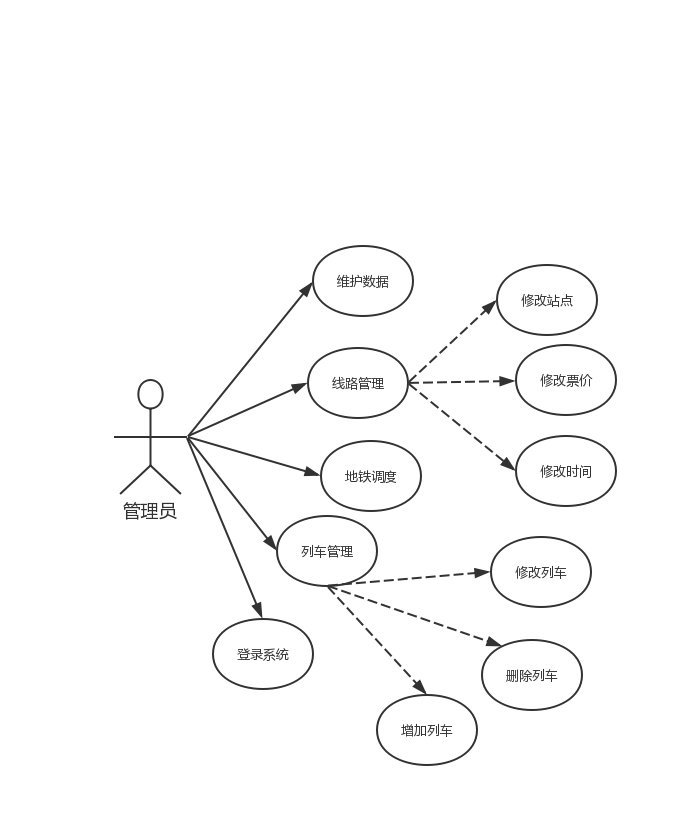
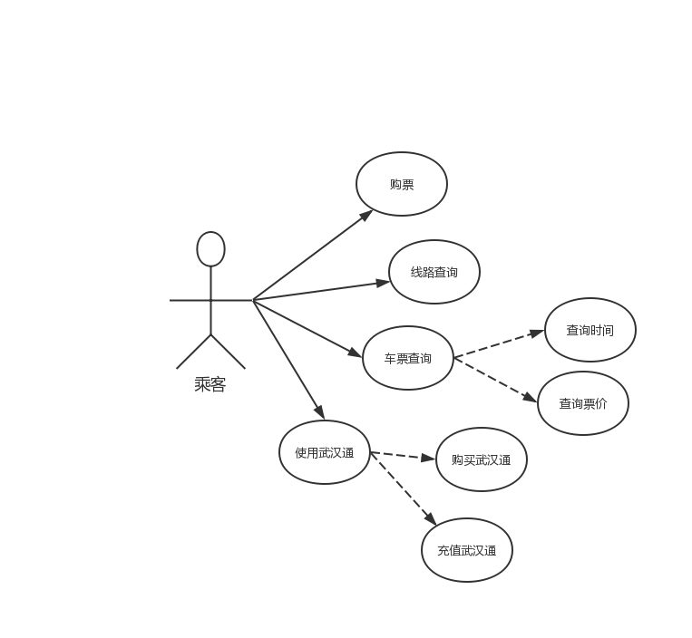
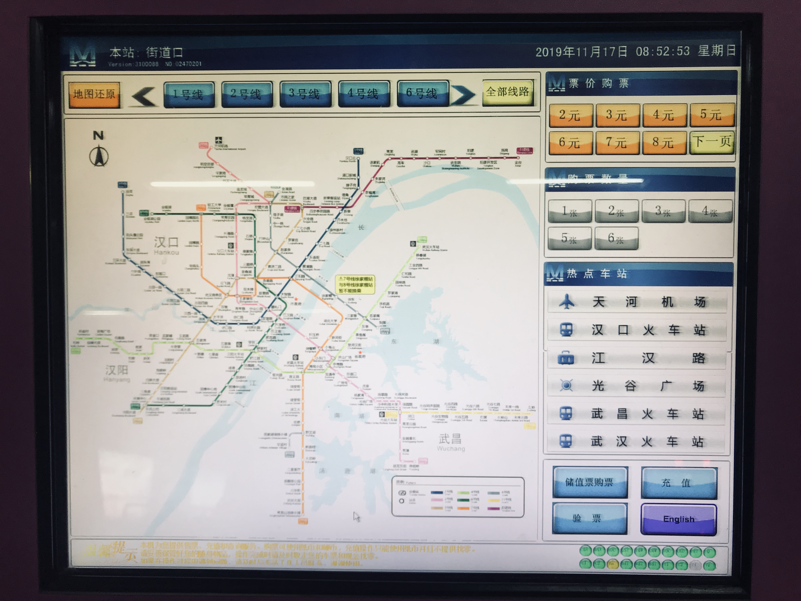
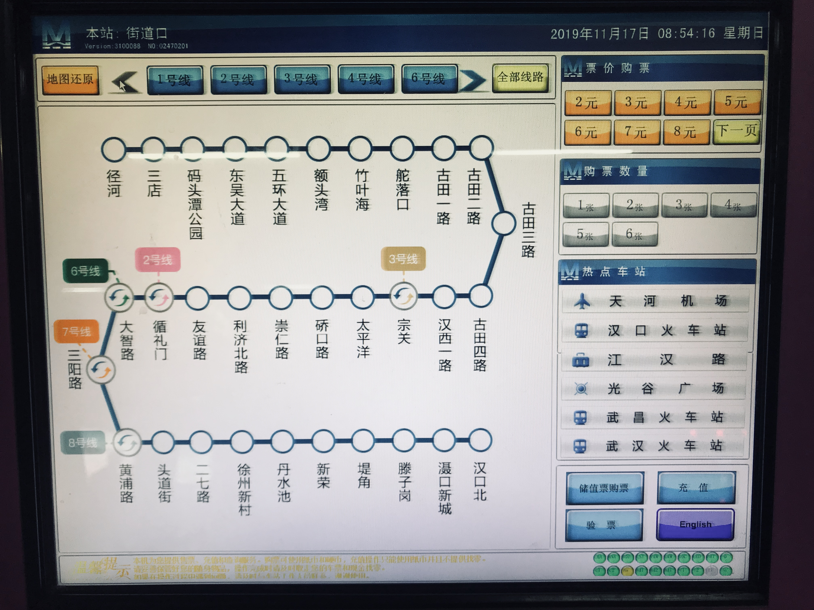
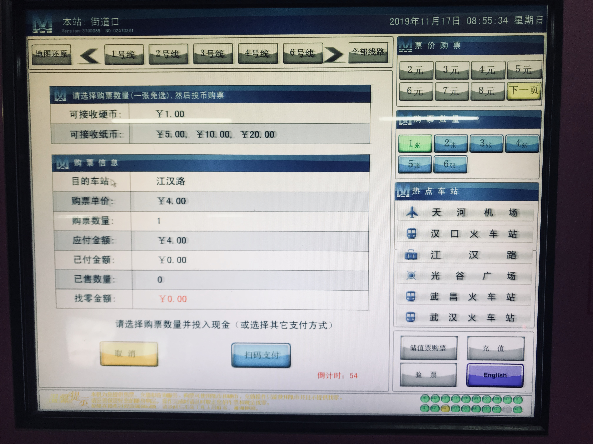

# 武汉地铁模拟运行系统需求规格说明书  

带哥照片:

## 修订历史记录

| 日期       | 版本 | 说明                          | 作者     |
| ---------- | ---- | ----------------------------- | :------- |
| 2019.11.17 | V1.0 | 第一个版本, 根据项目设想生成. | 李祺彦   |
| 2019.11.18 | V1.2 | 增加用例图, 完成2, 3.         | 王君孔帅 |
| 2019.11.21 | v1.3 | 1, 4, 5, 6 初步完成.          | 陈孜卓   |

## 1. 引言

### 1.1 编写目的

本文档编写基于以下准则:

(1) 理解并描述问题的信息域, 并以此建立数据模型.

(2) 定义软件应完成的功能, 并以此建立功能模型.

(3) 描述作为外部事件结果的软件行为, 建立行为模型.

(4) 对描述信息, 功能和行为的模型进行分解, 用层次的方式展示细节.

(5) 利于用户和开发者之间的交流, 为软件开发工作提供了基础和用于测试和验收的依据.

本文档面向多种读者对象:

(1) 项目经理: 了解预期产品的功能, 并据此进行系统设计, 项目管理.

(2) 系统分析员: 对目标系统提出完整, 准确, 清晰, 具体的要求.

(3) 设计员: 对需求进行分析, 并进行系统和功能设计, 包括数据库设计和安全设计.

(4) 程序员: 了解系统功能, 实现并优化软件功能, 编写《用户手册》.

(5) 测试员: 根据本文档编写测试用例及测试文档, 并对软件产品进行功能性测试和非功能性测试.

(6) 用户: 了解预期产品的功能和性能, 并与系统分析员一起对整个需求进行讨论和协商.

### 1.2 项目背景

A. 项目名称: 武汉地铁模拟运行系统.

B. 项目提出者: 李祺彦, 陈孜卓, 胡俊良, 黄一峰, 骆雅婧, 王君孔帅.

C. 项目开发者: 李祺彦, 陈孜卓, 胡俊良, 黄一峰, 骆雅婧, 王君孔帅.

D. 项目用户: 武汉地铁管理人员及乘客.

E. 项目开发单位: 武汉大学计算机学院.

F. 项目简介: 

地下铁道, 简称地铁, 亦简称为地下铁, 狭义上专指在地下运行为主的城市铁路系统或捷运系统; 但广义上, 由于许多此类的系统为了配合修筑的环境, 可能也会有地面化的路段存在, 因此通常涵盖了都会地区各种地下与地面上的高密度交通运输系统. 绝大多数的城市轨道交通系统都是用来运载市内通勤的乘客, 而在很多场合下城市轨道交通系统都会被当成城市交通的骨干. 通常, 城市轨道交通系统是许多都市用以解决交通堵塞问题的方法. 随着中国城市的迅速发展, 地铁承担着越来越重要的任务 -- 缓解城市交通压力.

G. 项目说明:

《武汉地铁模拟运行系统需求说明书》的目的是明确《武汉地铁模拟运行系统》中各项功能和非功能需求, 确定系统功能模块, 同时为概要设计和详细设计人员提供设计依据, 也可供本项目的其他开发人员参阅. 本需求分析报告的目的是规范化本软件的编写, 旨在于提高软件开发过程中的能见度, 便于对软件开发过程中的控制与管理, 同时提出了本地铁售票系统的软件开发过程, 便于程序员与客户之间的交流与协作, 并作为工作成果的原始依据, 同时也表明了本软件的共性, 以期能够获得更大范围的应用.

本文档需要交于论证人员进行论证修改, 无误后供软件开发人员进行后期的软件设计.

项目在目前的阶段与其他软件和系统没有关系, 作为一个独立的单位运行.

### 1.3 名称定义和缩写

| 名称   | 缩写      | 定义                                |
| :----- | :-------- | :---------------------------------- |
| 开发者 | Developer | 对系统进行设计, 开发和维护.         |
| 用户   | User      | 管理员和用户.                       |
| 乘客   | Client    | 系统对其具有透明性, 具有乘客权限.   |
| 管理员 | Admin     | 系统对其具有透明性, 具有管理员权限. |

### 1.4 参考文献

[1]. 张海藩, 牟永敏 著. 软件工程导论 (第6版) 北京: 清华大学出版社

[2]. 麻志毅 著.  面向对象分析与设计 (第2版) 北京: 机械工业出版社

[3]. 武汉地铁集团有限公司官网: https://www.wuhanrt.com/public_forward.aspx 

## 2. 系统需求概述

### 2.1 管理系统的用例图

### 2.2 购票系统的用例图

### 2.3 用例的概要描述

| 主要参与者 | 优先级 | 用例名                 | 用例概述                                    |
| :--------- | :----- | :--------------------- | :------------------------------------------ |
| 乘客       | 高     | 乘客购票               | 乘客可通过系统进行购票.                     |
| 乘客       | 高     | 乘客进行线路查询       | 乘客可通过界面上的地图进行路线查询.         |
| 乘客       | 高     | 乘客进行票价和时间查询 | 乘客可输入信息进行票价和时间查询.           |
| 乘客       | 高     | 乘客购买和充值武汉通   | 乘客选择武汉通卡并购买, 或插入武汉通并充值. |
| 管理员     | 中     | 管理员登录系统         | 管理员能够登录管理系统和售票系统.           |
| 管理员     | 中     | 管理员管理列车信息     | 管理员能够增加, 删除和修改列车的信息.       |
| 管理员     | 中     | 管理员管理线路信息     | 管理员能够增加, 删除地铁线路的信息 .        |
| 管理员     | 低     | 管理员维护数据         | 管理员可以进行数据的维护.                   |
| 管理员     | 高     | 管理员管理列车调度     | 管理员可以管理地铁列车的调度.               |

### 2.4 假设和依赖

1. 乘客必须具备基本的计算机知识.
2. 管理员必须经过一定的培训.

## 3. 功能需求

### 3.1 购票系统功能

用户在系统主页上可以查询任何线路上的任意站点信息. 用户根据自己想选择的线路在主页的地图上方进行选择, 然后确定起始站, 并确认购票数量和应付金额后, 点击购票按钮后, 在跳出的支付页面进行付款.

**计价规则**

4公里以内 (含4公里) , 2元;

4-12公里 (含12公里) , 1元/4公里;

12-24公里 (含24公里) , 1元/6公里;

24-40公里 (含40公里) , 1元/8公里;

40-50公里 (含50公里) , 1元/10公里;

50公里以上, 1元/20公里.

主页如下: 

操作流程如下: 

方法①选择线路 → 显示线路上的所有站名 → 点击站名 → 显示购票界面 → 选择购票张数 → 确认购票数量, 应付金额 → 点击购票按钮 → 在支付界面进行支付.

方法②直接点击站名 → 显示购票界面 → 选择购票张数 → 确认购票数量, 应付金额 → 点击购票按钮 → 在支付界面进行支付.

方法③在主页输入站名并点击购票 → 显示购票界面 → 选择购票张数 → 确认购票数量, 应付金额 → 点击购票按钮 → 在支付界面进行支付.

线路1界面如下: 

付款界面如下: 

### 3.2 管理系统功能

正常情况下地铁系统在后台运行, 根据后台存储的运行时间数据自动进行调度. 当发生新情况, 例如需要增加地铁线路, 增开地铁, 关闭地铁站, 关闭某条线路时, 管理员可通过管理系统对地铁系统进行管理.

#### 3.2.1 自动调度

按照设定的发车次数或发车时间间隔, 并根据里程, 速度和停站时间, 在后台自动计算每一趟列车的发车时间和到达每一站的时间. 在用户购票时, 获取系统时间, 对比列车运行时间和到站时间, 计算出用户到达重点预计需要的时间.

#### 3.2.2 增加地铁线路

当有新的地铁线路时, 管理员在管理系统中输入这条线路的路线名, 站名, 每一站在武汉市地图上的位置, 线路中每一段的长度, 发车时间间隔, 系统根据这些信息, 更新地图, 重新计算修改后所有的两站之间的最短距离, 重新制定票价.

#### 3.2.3 增开地铁

在出现特殊情况时, 可能需要增开地铁 (例如, 武汉大学开学时, 增开二号线地铁, 从武汉站直达街道口). 管理员输入需要增开的地铁的相关信息: 起点, 终点, 是否停站, 发车时间, 后台实现重新调度.

#### 3.2.4 关闭/恢复地铁站或关闭/恢复线路

出现事故或者洪水等自然灾害时, 可能需要关闭地铁站或者关闭整个线路. 例如长沙发生洪水时, 橘子洲被淹, 橘子洲地铁站关闭, 地铁正常通过橘子洲站但不停车. 如果某段地铁出现故障, 则应该封锁整条线. 地铁管理员在后台输入关闭的站名, 改站在地图中变为灰色, 乘客不能买到这一站的票. 如果关闭一条线路, 则地图中该线路变成灰色. 恢复则相反.

## 4. 非功能需求

### 4.1 安全性

| **需求分类** | **定义要素**   | **需求内容**                                                 |
| ------------ | -------------- | ------------------------------------------------------------ |
| 系统安全     | 安全机制独立性 | 安全设计和实现应该具有独立性, 不能依赖当前主机的基础安全机制来确保自身和数据不受破环或拒绝服务. |
| 系统安全     | 安全机制有效性 | 应防止用户绕过其安全控制机制直接尝试访问系统各项功能.        |
| 系统安全     | 访问权限       | 对不同用户的访问权限进行严格的访问控制, 特定权限的用户只能看到和使用特定的界面及相应的功能. |
| 系统安全     | 输入限制       | 具备输入字符和输入数据的类型, 长度和范围检查功能.            |
| 系统安全     | 防止SQL注入    | 系统应没有SQL注入情况.                                       |
| 系统安全     | 权限初始化     | 用户的权限应该符合最小权限原则.                              |
| 系统安全     | 并发操作保护   | 允许用户对同一系统资源进行不相冲突的访问操作但应该禁止执行相互矛盾的操作, 如两个用户同时修改一个资源. |
| 系统安全     | 异常事件       | 应该定义了分级的系统异常事件, 并且根据异常的严重程度分别采用日志记录, 警告提示等方式进行通知。对部分严重故障自动处理, 使学生信息系统恢复正常状态或保护现存数据安全. |
| 系统安全     | 安全日志系统   | 所有的系统出错信息都必须被记录到出错日志中, 信息的格式必须是系统错误号码, 日期, 时间, 错误信息. 和用户相关的每个页面迁移信息都必须被记录到追寻日志中. 信息的格式必须是用户帐号, 日期, 时间, 迁移的页面名. 每次处理前后的消耗的内存和处理时间都必须被记录到性能日志中. 信息的格式必须是日期、时间, 消耗的内存, 处理时间. |
| 系统安全     | 安全邮件系统   | 系统所有的电子邮件必须通过预先设定的邮件系统发送.            |
| 系统安全     | 安全监视系统   | 监视系统必须扫描日志系统如果有任何异常的情况, 必须使用邮件系统向管理员发警告信. |
| 系统安全     | 安全系统       | 安全系统必须拦截非法的访问, 和对网站的恶意进攻包括 (XSS , SQL Injection, 非法盗链等, 非法字符输入等). |
| 数据安全     | 数据完整性     | 能够检测到网络设备操作系统, 主机操作系统, 数据库管理系统以及学生信息系统的重要业务数据在传输过程中完整性受到破坏. |

### 4.2 易用性

| **需求分类** | **定义要素**                                                 | **需求内容**                                                 |
| ------------ | ------------------------------------------------------------ | ------------------------------------------------------------ |
| 用户界面     | 界面风格要求.                                                | 提供一致性的图形用户界面风格; 对普通用户的操作界面应该以B/S方式实现; 支持同时打开多个管理窗口, 以对不同任务进行并行操作. 系统的客户端必须是 Web 浏览器, 不需要安装额外的软件.同时，用户界面设计必须简单明了, 不需要乘客花费额外的时间来学习. |
| 界面导航要求 | 功能菜单必须按照功能模块, 功能项的分类方法进行组织; 对于用户无权使用的菜单功能应不显示该菜单或将其设置为不可用状态. | 每个模块相互分隔, 逻辑功能尽可能保持较小的冗余度.            |
| 界面输入要求 | 操作界面必须明确表示出必填的输入信息. 可以按照操作名称建立索引, 点击该事件后可以查看与该事件相关的应急相关信息. 可以按照关键字进行搜索, 系统在界面中将搜索结果分条展示. | 每个可能的输入都有确定的返回值，如果出现异常会及时报错并提供正确的帮助信息. |
| 界面提示要求 | 发现用户提交有误信息, 必须以弹出窗口的形式明确提示用户错误的原因, 并把界面控制焦点置于发生错误的控件对象上; 在导致数据发生变化的操作执行之前, 应该弹出提示窗口供用户确认; 当学生信息系统正在执行用户提交的请求而无法返回时, 必须明确表示平台处于繁忙阶段, 并可以让用户取消操作. | 地铁售票系统的每个重要页面上必须都有相关的帮助页面的链接，乘客可以使用它们来获得必要的帮助信息. |

### 4.3 可靠性

**▶  可用性**

地铁售票系统必须能够24小时*7天的工作. 

**▶  系统发生严重错误的平均时间间隔**

系统发生严重错误的平均时间间隔应该大于3000小时.

### 4.4 性能

**▶  最大的并发人数**

地铁售票系统的最大并发访问数应该为1000. 在这个范围内, 系统应该能够很好的工作.

**▶  最大系统响应时间**

在最大并发数为1000范围内时, 系统对用户的最大相应时间应该小于10秒/1万条数据.

**▶  最大的事务处理时间**

地铁售票系统的用户事务的最大处理时间是30秒, 如果超过这个时间系统应该自动结束用户的事务处理.

**▶  单次的事务处理时间**

地铁售票系统单次响应时间最大为3秒, 网页刷新响应在正常网速下要求低于30ms.

## 5. 运行环境规定

**▶  数据库管理软件**

系统必须使用 Python 接口同关系型数据库管理软件建立连接.

**▶  Web 服务器软件**

系统必须使用支持 J2EE 规范的 Web 服务器软件.

**▶  平台要求**

系统必须在 CPU 为 P3 以上, 内存为 512MB 以上, 操作系统为微软 win2000 以上或 Linux(Unix) 的数据库服务器上顺利运行.

**▶   Web 浏览器**

系统的用户界面必须在 IE 8.0 以上或 Chrome70.0 以上的浏览器正常显示.

**▶  Python 的版本**

系统必须在 Python 3.7 以上的版本上运行.

## 6. 验收验证标准

### 6.1 界面验收标准

| 序号 | 界面名称           | 界面描述及预期效果                                           |
| ---- | ------------------ | ------------------------------------------------------------ |
| 1    | 登录界面           | 显示输入用户名输入框, 密码输入框, 口令输入框, 选择用户种类 (管理员或乘客), 选择注册或登录. |
| 2    | 乘客首页           | 显示地铁总地图, 缩放按钮, 站点选择按钮, 线路选择按钮, 票价购票按钮, 购票数量按钮, 热点车站按钮, 充值按钮, 语言选择按钮, 个人信息按钮, 返回主页按钮, 帮助按钮, 版本查看按钮. |
| 3    | 乘客线路界面       | 显示用户选择的单条线路地图, 站点选择按钮, 线路选择按钮, 票价购票按钮, 购票数量按钮, 热点车站按钮, 充值按钮, 语言选择按钮, 个人信息按钮, 返回主页按钮, 帮助按钮, 版本查看按钮. |
| 4    | 乘客购票界面       | 显示购票信息 (目的车站, 购票单价, 购票数量, 应付金额, 账户余额, 扫码支付按钮, 取消按钮, 线路选择按钮, 票价购票按钮, 票价数量按钮, 热点车站按钮, 充值按钮, 语言选择按钮, 个人信息按钮, 返回主页按钮, 帮助按钮, 版本查看按钮. |
| 5    | 乘客付款界面       | 显示胡俊良带哥对应票面的支付宝和微信二维码及联系方式. 在扫描成功后能显示胡俊良带哥的大头照, 并有一定的几率显示胡俊良带哥的证件照. (不可退出, 考虑while(1){ }死循环) |
| 6    | 乘客信息界面       | 显示乘客名称, 乘客头像, 乘客账号, 乘客性别, 乘客生日, 乘客论坛 (可考虑开发), 乘客余额, 绑定微信号, 绑定按钮, 解绑按钮, 收藏站点, 收藏线路, 近期站点, 近期线路, 近期流水, 充值按钮, 语言选择按钮, 返回主页按钮, 帮助按钮, 版本查看按钮. |
| 7    | 乘客操作介绍界面   | 显示乘客操作简介, 语言选择按钮, 返回按钮.                    |
| 8    | 乘客版本界面       | 显示系统简介, 版本信息, 上次优化内容, 语言选择按钮, 返回按钮. |
| 9    | 管理员首页         | 显示第铁总地图, 缩放按钮, 站点选择按钮, 线路选择按钮, 增加站点按钮, 删除站点按钮, 增加线路按钮, 删除线路按钮, 语言选择按钮, 个人信息按钮, 版本控制按钮 (撤销, 重做, 回滚...), 切换视角按钮, 返回主页按钮, 帮助按钮, 版本查看按钮. |
| 10   | 管理员线路界面     | 显示单条线路地图, 站点选择按钮, 线路选择按钮, 增加站点按钮, 删除站点按钮, 增加线路按钮, 删除线路按钮, 语言选择按钮, 个人信息按钮, 版本控制按钮 (撤销, 重做, 回滚...), 切换视角按钮, 返回主页按钮, 帮助按钮, 版本查看按钮. |
| 11   | 管理员数据库界面   | 显示数据库中的线路信息, 站点信息, 热点车站信息, 数据库版本, 数据库近期修改记录, 增加站点按钮, 删除站点按钮, 增加线路按钮, 删除线路按钮, 语言选择按钮, 个人信息按钮, 版本控制按钮 (撤销, 重做, 回滚...), 返回主页按钮, 帮助按钮, 版本查看按钮. |
| 12   | 管理员流水界面     | 显示近期流水信息(用户名, 流水日期, 流水号, 流水信息), 语言选择按钮, 返回主页按钮, 帮助按钮, 版本查看按钮. |
| 13   | 管理员信息界面     | 显示管理员名称, 管理员权限, 管理员操作记录, 绑定微信号, 绑定按钮, 解绑按钮, 语言选择按钮, 返回主页按钮, 帮助按钮, 版本查看按钮. |
| 14   | 管理员操作介绍界面 | 显示管理员操作简介, 返回按钮.                                |
| 15   | 管理员版本界面     | 显示系统简介, 版本信息, 上次修改内容, 语言选择按钮, 返回按钮. |

### 6.2 功能验收标准

| 序号 | 功能名称             | 详细操作                                                     | 预期效果                                                     |
| ---- | -------------------- | :----------------------------------------------------------- | ------------------------------------------------------------ |
| 1    | 通用: 登录账号       | 输入用户名, 密码, 用户类型 (乘客或管理员)                    | 成功登录账号并弹窗通知, 跳转至乘客或者管理员首页.            |
| 2    | 通用: 注册账号       | 输入用户名, 密码, 口令 (管理员需输入)                        | 成功注册账号并弹窗通知, 跳转至乘客或者管理员首页.            |
| 3    | 乘客: 选择线路       | 可点击路线按钮或者图上中路线上非站点的位置选择路线           | 跳转至对应路线的乘客线路界面.                                |
| 4    | 乘客: 选择站点       | 可点击站点选择按钮或者图上的站点的位置选择站点               | 再选择一个站点跳转至乘客购票界面, 或选择一条线路后跳转至对应路线的乘客线路界面. |
| 5    | 乘客: 地图缩放       | 点击放大缩小按钮实现缩放.                                    | 后期实现文字按比例缩放.                                      |
| 6    | 乘客: 票数选择       | 点击按钮选择票数.                                            | 点击后按钮颜色变化, 并且点击下一个按钮时上一个按钮复原.      |
| 7    | 乘客: 购票           | 点击购票按钮.                                                | 只有在选择好线路, 站点, 票数后跳转至乘客付款界面, 否则报错.  |
| 8    | 乘客: 选择热点车站   | 点击按钮选择热点车站.                                        | 点击后按钮颜色变化, 并且点击下一个按钮时上一个按钮复原. 再选择一个站点跳转至乘客购票界面, 或选择一条线路后跳转至对应路线的乘客线路界面. |
| 9    | 乘客: 充值           | 点击充值按钮.                                                | 在绑定微信号的情况下, 跳转至乘客付款界面. 否则, 提示未绑定微信号并跳至乘客信息界面. |
| 10   | 乘客: 语言切换       | 点击语言选择按钮.                                            | 实现中文和英文的切换.                                        |
| 11   | 乘客: 取消购票       | 点击取消按钮.                                                | 取消购票并返回至乘客购票界面.                                |
| 12   | 乘客: 编辑个人信息   | 点击个人信息按钮.                                            | 跳至乘客个人信息界面并进行编辑.                              |
| 13   | 乘客: 返回主页       | 点击返回主页按钮.                                            | 跳至乘客主页.                                                |
| 14   | 乘客: 扫码付款       | 扫码.                                                        | 给胡俊良带佬转钱并自动添加好友, 且不能删除也不能拉黑也不能屏蔽. 胡大佬自动置顶, 后台每天给胡大佬道早晚安. |
| 15   | 乘客: 查看余额       | 点击个人信息按钮.                                            | 跳至乘客个人信息界面并查看余额.                              |
| 16   | 乘客: 绑定微信号     | 点击个人信息按钮, 点击绑定微信按钮.                          | 成功绑定微信号并弹窗提示.                                    |
| 17   | 乘客: 解绑微信号     | 点击个人信息按钮, 点击解绑按钮.                              | 成功解绑微信号并弹窗提示.                                    |
| 18   | 乘客: 查看收藏站点   | 点击个人信息按钮, 点击收藏站点按钮.                          | 收藏站点以列表模式显示.                                      |
| 19   | 乘客: 新增收藏站点   | 在乘客主页或者乘客线路界面长按可以选择新增收藏站点.          | 可以在个人信息界面的收藏站点处看到新增的收藏站点.            |
| 20   | 乘客: 删除收藏站点   | 在乘客主页或者乘客线路界面长按可以选择删除收藏站点, 或在个人信息界面直接删除, 可单选或多选. | 可以在个人信息界面的收藏站点处看到收藏站点被删除.            |
| 21   | 乘客: 查看收藏线路   | 点击个人信息按钮, 点击收藏线路按钮.                          | 收藏线路以列表模式显示.                                      |
| 22   | 乘客: 新增收藏线路   | 在乘客主页或者乘客线路界面长按可以选择新增收藏线路.          | 可以在个人信息界面的收藏线路处看到新增的收藏线路.            |
| 23   | 乘客: 删除收藏线路   | 在乘客主页或者乘客线路界面长按可以选择删除收藏线路, 或在个人信息界面直接删除, 可单选或多选. | 可以在个人信息界面的收藏线路处看到收藏站点被删除.            |
| 24   | 乘客: 查看近期站点   | 点击个人信息按钮, 点击近期站点按钮.                          | 近期站点以列表模式显示.                                      |
| 25   | 乘客: 删除近期站点   | 点击个人信息按钮, 点击近期站点按钮, 直接删除, 可单选或多选.  | 可以在个人信息界面的近期站点处看到近期站点被删除.            |
| 26   | 乘客: 查看近期线路   | 点击个人信息按钮, 点击近期路线按钮.                          | 近期线路以列表模式显示.                                      |
| 27   | 乘客: 删除近期线路   | 点击个人信息按钮, 点击近期路线按钮, 直接删除, 可单选或多选.  | 可以在个人信息界面的近期线路处看到近期线路被删除.            |
| 28   | 乘客: 查看近期流水   | 点击个人信息按钮, 点击近期流水按钮.                          | 近期流水以列表模式显示.                                      |
| 29   | 乘客: 删除近期流水   | 点击个人信息按钮, 点击近期流水按钮, 直接删除, 可单选或多选.  | 可以在个人信息界面的近期流水处看到近期流水被删除.            |
| 30   | 乘客: 查看操作简介   | 点击帮助按钮.                                                | 跳转至乘客操作介绍页面. 点击返回按钮, 返回上一个界面.        |
| 31   | 乘客: 查看版本信息   | 点击查看版本按钮.                                            | 跳转至乘客版本界面. 点击返回按钮, 返回上一个界面.            |
| 32   | 管理员: 选择线路     | 可点击路线按钮或者图上中路线上非站点的位置选择路线           | 跳转至对应路线的管理员线路界面.                              |
| 33   | 管理员: 选择站点     | 可点击站点选择按钮或者图上的站点的位置选择站点               | 跳转至对应路线的管理员线路界面.                              |
| 34   | 管理员: 地图缩放     | 点击放大缩小按钮实现缩放.                                    | 后期实现文字按比例缩放.                                      |
| 35   | 管理员: 增加站点     | 在管理员数据库界面增加站点.                                  | 合法的情况下成功增加站点.                                    |
| 36   | 管理员: 删除站点     | 在管理员数据库界面删除站点.                                  | 合法的情况下成功删除站点.                                    |
| 37   | 管理员: 增加线路     | 在管理员数据库界面增加线路.                                  | 合法的情况下增加线路.                                        |
| 38   | 管理员: 减少线路     | 在管理员数据库界面删除线路.                                  | 合法的情况下删除线路.                                        |
| 39   | 管理员: 切换语言     | 点击语言选择按钮.                                            | 实现中文和英文的切换.                                        |
| 40   | 管理员: 返回主页     | 点击返回主页按钮.                                            | 跳至管理员主页.                                              |
| 41   | 管理员: 编辑个人信息 | 点击个人信息按钮.                                            | 跳至管理员个人信息界面并进行编辑.                            |
| 42   | 管理员: 版本控制     | 输入版本控制命令.                                            | 执行相应的版本控制命令.                                      |
| 43   | 管理员: 切换视角     | 点击视角切换按钮.                                            | 跳至对应的用户界面, 在按任意键后返回.                        |
| 44   | 管理员: 查看权限     | 点击个人信息按钮, 点解权限查看按钮.                          | 显示管理员权限.                                              |
| 45   | 管理员: 查看操作记录 | 点击个人信息按钮，点击操作记录查看按钮.                      | 显示管理云操作记录信息.                                      |
| 46   | 管理员: 查看数据库   | 点击个人信息按钮，点击数据库查看按钮.                        | 显示数据库内容及近期版本控制信息.                            |
| 47   | 管理员: 绑定微信号   | 点击个人信息按钮, 点击绑定微信按钮.                          | 成功绑定微信号并弹窗提示.                                    |
| 48   | 管理员: 解绑微信号   | 点击个人信息按钮, 点击解绑按钮.                              | 成功解绑微信号并弹窗提示.                                    |
| 49   | 管理员: 查看流水信息 | 点击个人信息按钮, 点击流水信息按钮.                          | 近期流水以列表模式显示.                                      |
| 50   | 管理员: 查看操作简介 | 点击帮助按钮.                                                | 跳转至管理员操作介绍页面. 点击返回按钮, 返回上一个界面.      |
| 51   | 管理员: 查看版本信息 | 点击查看版本按钮.                                            | 跳转至管理员版本界面. 点击返回按钮, 返回上一个界面.          |

## 7. 团队分工 

### 7.1 迭代1阶段分工

李祺彦: 需求分析文档1.0版.

陈孜卓: 需求分析文档第4, 6节 (要等2、3节写完).

胡俊良: 需求分析文档第1, 5节, 维护项目主页 (https://hot-dry-noodles.github.io).

黄一峰: 爬虫抓取武汉地铁运营数据 (时间相关信息, 地铁各段线路长度等).

骆雅婧: 找合适的网页模板, 获得真实的武汉地铁购票系统界面.

王君孔帅: 充当客户的角色, 写需求分析文档2, 3节.

### 7.2 迭代2,迭代3阶段分工

等2 3 4节写完了再写
